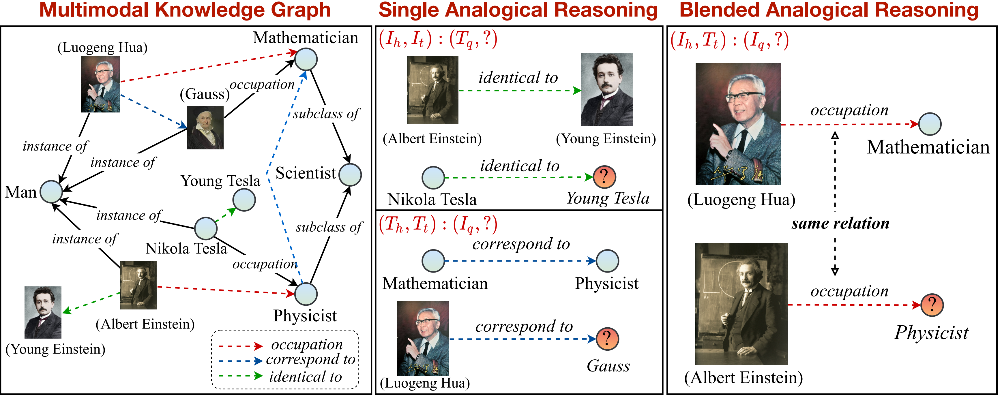
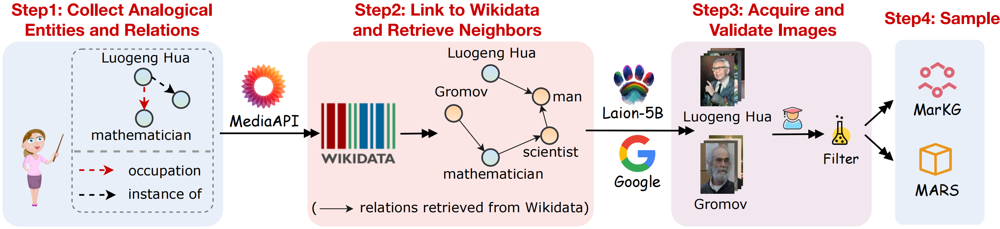
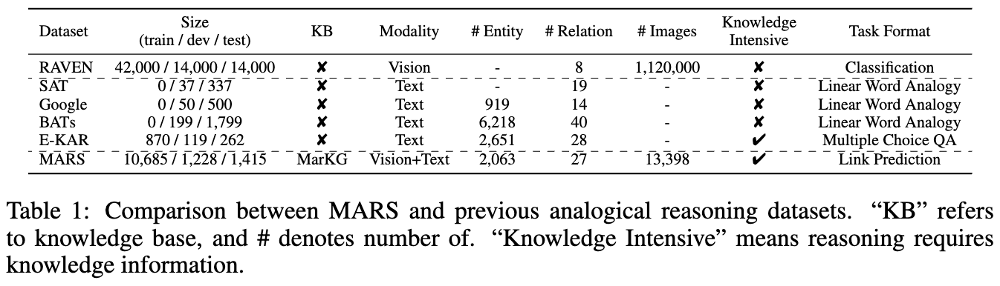
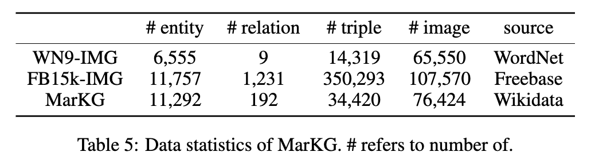
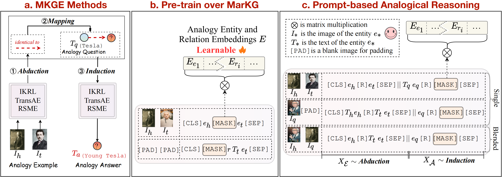

# MKG_Analogy

Code and datasets for the ICLR2023 paper "[Multimodal Analogical Reasoning over Knowledge Graphs](https://arxiv.org/pdf/2210.00312.pdf)"
- ❗New: We provide a Huggingface Demo at [https://huggingface.co/spaces/zjunlp/MKG_Analogy](https://huggingface.co/spaces/zjunlp/MKG_Analogy), have fun!
- ❗New: We have released the Checkpoints at [Google Drive](https://drive.google.com/drive/folders/1ul9vC93t_e5t_fDj3zzgJKqPoPn_jgsX?usp=share_link) for reproducibility.
- ❗New: We have released the Powerpoint at [ICLR2023_MKG_Analogy.pdf](resource/ICLR2023_MKG_Analogy.pdf).

## Quick links
* [MKG_Analogy](#MKG_Analogy)
    * [Overview](#overview)
    * [Requirements](#requirements)
    * [Data Preparation](#data-collection-and-preprocessing)
    * [Evaluate on Benchmark Mehods](#evaluate-on-benchmark-mehods)
        * [Multimodal Knowledge Representation Methods](#multimodal-knowledge-representation-methods)
        * [Transformer-based Methods](#transformer-based-methods)
    * [Citation](#citation)


## Overview

<div align=center>

</div>

In this work, we propose a new task of multimodal analogical reasoning over knowledge graph. A overview of the Multimodal Analogical Reasoning task can be seen as follows:

<div align=center>

</div>

We provide a knowledge graph
to support and further divide the task into single and blended patterns. Note that the relation marked
by dashed arrows ($\dashrightarrow$) and the text around parentheses under images are only for annotation and
not provided in the input.

## Requirements

```setup
pip install -r requirements.txt
```

## Data Collection and Preprocessing

To support the multimodal analogical reasoning task, we collect a multimodal knowledge graph dataset MarKG and a Multimodal Analogical ReaSoning dataset MARS. A visual outline of the data collection as shown in following figure:

<div align=center>

</div>

We collect the datasets follow below steps:
1. Collect Analogy Entities and Relations
2. Link to Wikidata and Retrieve Neighbors
3. Acquire and Validate Images
4. Sample Analogical Reasoning Data

The statistics of the two datasets are shown in following figures:

<div align=center>

</div>


<div align=center>

</div>

We put the text data under `MarT/dataset/`, and the image data can be downloaded through the [Google Drive](https://drive.google.com/file/d/1AqnyrA05vKngfEbhw1mxY5qEoaqiKsC1/view?usp=share_link) or the [Baidu Pan(TeraBox) (code:7hoc)](https://pan.baidu.com/s/1WZvpnTe8m0m-976xRrH90g) and placed on `MarT/dataset/MARS/images`. Please refer to [MarT](MarT/dataset/README.md) for details.

The expected structure of files is:

```
MKG_Analogy
 |-- M-KGE	# multimodal knowledge representation methods
 |    |-- IKRL_TransAE   
 |    |-- RSME
 |-- MarT
 |    |-- data          # data process functions
 |    |-- dataset
 |    |    |-- MarKG    # knowledge graph data
 |    |    |-- MARS     # analogical reasoning data
 |    |-- lit_models    # pytorch_lightning models
 |    |-- models        # source code of models
 |    |-- scripts       # running scripts
 |    |-- tools         # tool function
 |    |-- main.py       # main function
 |-- resources   # image resources
 |-- requirements.txt
 |-- README.md

```

## Evaluate on Benchmark Mehods

We select some baseline methods to establish the initial benchmark results on MARS, including multimodal knowledge representation methods (IKRL, TransAE, RSME), pre-trained vision-language models (VisualBERT, ViLBERT, ViLT, FLAVA) and a multimodal knowledge graph completion method (MKGformer).

<div align=center>

</div>

In addition, we follow the structure-mapping theory to regard the Abudction-Mapping-Induction as explicit pipline steps for multimodal knowledge representation methods. As for transformer-based methods, we further propose MarT, a novel framework that implicitly combines these three steps to accomplish the multimodal analogical reasoning task end-to-end, which can avoid error propagation during analogical reasoning. The overview of the baseline methods can be seen in above figure.

### Multimodal Knowledge Representation Methods
#### 1. [IKRL](https://github.com/thunlp/IKRL)

We reproduce the IKRL models via TransAE framework, to evaluate on IKRL, running following code:
```bash
cd M-KGE/IKRL_TransAE
python IKRL.py
```

You can choose pre-train/fine-tune and TransE/ANALOGY  by modifing `finetune` and `analogy` parameters in `IKRL.py`, respectively.


#### 2. [TransAE](https://github.com/ksolaiman/TransAE)

To evaluate on IKRL, running following code:
```bash
cd M-KGE/IKRL_TransAE
python TransAE.py
```

You can choose pre-train/fine-tune and TransE/ANALOGY  by modifing `finetune` and `analogy` parameters in `TransAE.py`, respectively.

#### 3. [RSME](https://github.com/wangmengsd/RSME)
We only provide part of the data for RSME. To evaluate on RSME, you need to generate the full data by following scripts:
```bash
cd M-KGE/RSME
python image_encoder.py  # -> analogy_vit_best_img_vec.pickle
python utils.py          # -> img_vec_id_analogy_vit.pickle
```

Firstly, pre-train the models over MarKG:
```bash
bash run.sh
```
Then modify the `--checkpoint` parameter and fine-tune the models on MARS:
```bash
bash run_finetune.sh
```

More training details about the above models can refer to their [offical repositories](https://github.com/wangmengsd/RSME).

### Transformer-based Methods

We leverage the MarT framework for transformer-based models. MarT contains two steps: pre-train and fine-tune. 

To train the models fast, we encode the image data in advance with this script (Note that the size of the encoded data is about 7GB):
```bash
cd MarT
python tools/encode_images_data.py
```

Taking MKGformer as an example, first pre-train the model via following script:
```bash
bash scripts/run_pretrain_mkgformer.sh
```

After pre-training, fine-tune the model via following script:
```bash
bash scripts/run_finetune_mkgformer.sh
```

&#x1F353; We provide the best checkpoints of transformer-based models during the fine-tuning and pre-training phrases at this [Google Drive](https://drive.google.com/drive/folders/1ul9vC93t_e5t_fDj3zzgJKqPoPn_jgsX?usp=share_link). Download them and add `--only_test` in `scripts/run_finetune_xxx.sh` for testing experiments.

## Citation

If you use or extend our work, please cite the paper as follows:

```bibtex
@inproceedings{
zhang2023multimodal,
title={Multimodal Analogical Reasoning over Knowledge Graphs},
author={Ningyu Zhang and Lei Li and Xiang Chen and Xiaozhuan Liang and Shumin Deng and Huajun Chen},
booktitle={The Eleventh International Conference on Learning Representations },
year={2023},
url={https://openreview.net/forum?id=NRHajbzg8y0P}
}
```
